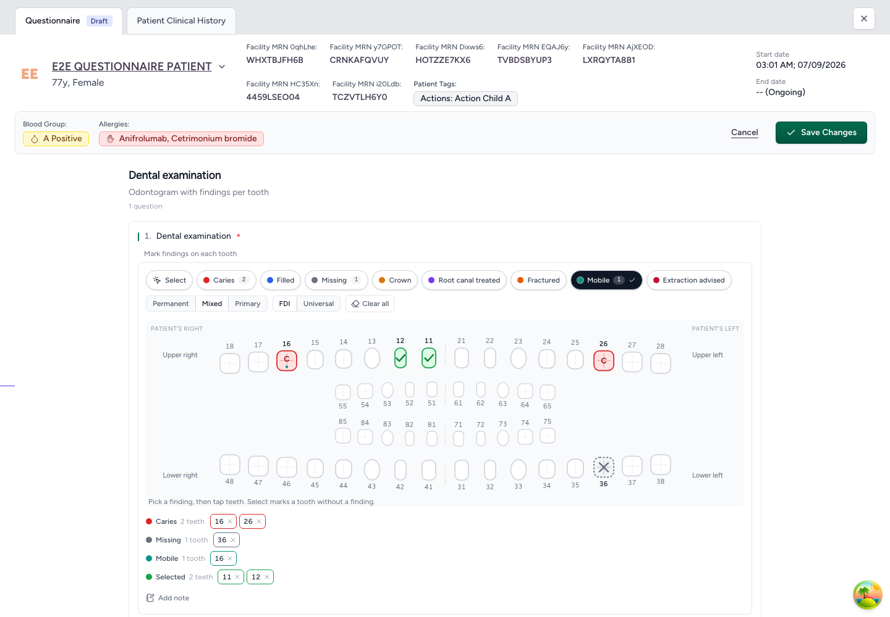

# care_dental_fe

A **dental chart (odontogram)** question type for the [CARE](https://github.com/ohcnetwork/care_fe)
questionnaire, shipped as a frontend-only CARE plugin. Questionnaire authors add a
"Dental chart" question in the studio; clinicians mark teeth on an interactive chart while
filling the form; the answer is stored on the questionnaire response itself, so the plugin
needs **no backend changes**.



## What it does

- **One structured question type**, `care_dental_fe.tooth_chart`, listed as *Dental chart*
  under *Structured* in the studio's type picker (encounter and patient questionnaires).
- **The chart**: all 32 permanent teeth in FDI/ISO 3950 layout, patient's right on the
  viewer's left, with an optional inner row for the 20 primary teeth (*Permanent · Mixed ·
  Primary*). Numbers switch between FDI and Universal (ADA); the choice is remembered per
  browser.
- **Findings as brushes**: *Select* marks a tooth without a finding; *Caries, Filled,
  Missing, Crown, Root canal treated, Fractured, Mobile, Extraction advised* mark it with
  one. Tap a tooth to toggle; drag across teeth to paint several; click a quadrant name to
  mark the whole quadrant. A tooth can carry several findings.
- **Reads back as text**: a summary lists every finding with its teeth, each removable on
  its own, and an optional note. The same component renders the stored answer read-only in
  the encounter's *Responses* tab, the single-response page and print.
- **Keyboard and screen readers**: one tab stop per chart, arrows move between teeth
  (up/down cross the arch), Space/Enter toggle, each tooth is named ("Upper right first
  molar, 16, Caries").

## The recorded answer

The question's answer is a list of involved teeth:

```json
[
  { "tooth": "16", "marks": ["caries", "mobile"] },
  { "tooth": "36", "marks": ["missing"] },
  { "tooth": "11" }
]
```

- `tooth` — the FDI code (`11`–`48` permanent, `51`–`85` primary). The only identifier
  stored; Universal numbering is a display option.
- `marks` — finding ids from the legend, in legend order. Absent for a plain selection.

On the wire the host submits that list as the question's single value, serialized to JSON
(the backend's submit value is a plain string), with the optional note beside it:

```json
{
  "question_id": "…",
  "values": [{ "value": "[{\"tooth\":\"16\",\"marks\":[\"caries\",\"mobile\"]},…]" }],
  "note": "Generalised gingival recession"
}
```

The backend stores this verbatim (it validates nothing for structured questions), so the
answer is available from `cleaned_response` under the question's `link_id` and survives
without the plugin being loaded. The host decodes it again before handing it to this
plugin's component, so the plugin itself never sees the wire format.

## How it plugs into CARE

The host contract this plugin uses is `structuredQuestionTypes` in `PluginManifest`
(`care_fe/src/pluginTypes.ts`), with **`persistence: "response"`**: the host submits the
recorded entries as the question's own `values` instead of calling `buildRequests`, and the
response viewers hand the stored answer back to the same component, disabled. The types
this plugin depends on are mirrored in [`src/types/host.ts`](src/types/host.ts) — keep it in
sync with the host when either side changes.

Layout of the source:

- `src/manifest.tsx` — the manifest: one structured type, lazily loaded.
- `src/lib/teeth.ts` — the dentition as data (FDI ↔ Universal, quadrants, chart rows).
- `src/lib/markers.ts` — the legend (ids, glyphs, colors).
- `src/lib/chart.ts` — the answer model and every operation on it (pure, tested).
- `src/components/tooth-chart/` — the chart UI: `ToothChartInput` (the structured input),
  `ToothChart` (rows, painting, keyboard), `ToothButton`/`ToothGlyph`, `BrushBar`,
  `ChartSummary`, `ChartNote`.
- `public/locale/en.json` — the plugin's i18n namespace (`care_dental_fe`); English strings
  are also the in-code defaults, other languages load from `<plugin origin>/locale/<lng>.json`.
- `src/style/index.css` — the stylesheet the remote injects into the host: Tailwind
  utilities compiled against the host's theme tokens (`theme(reference)`), no preflight and no
  `:root` theme of its own. At build time every selector is nested under the root class
  `.care-dental-fe` (`scopeToPluginRoot` in `vite.config.ts`): the host is a Tailwind app
  with the same class names, and an unscoped second utility sheet overrides the host's
  responsive variants (`hidden md:flex`) across the whole page. `src/index.tsx` is the
  production entry; `index.html` → `src/standalone.tsx` (with `harness.css`) is the dev
  harness and is not part of the build.

## Development

```bash
npm install
npm test          # data-model tests (node --test)
npm run typecheck
npm run lint
npm run dev       # standalone harness: the chart with local state, no CARE needed
```

### In-tree with the host (recommended)

Place this repository at `care_fe/apps/care_dental_fe` as a real directory (not a symlink)
and run the host's `npm run dev`. The host auto-discovers `apps/*/src/manifest.tsx`, serves
the plugin through its own Vite graph with HMR, and loads the locale from
`/local-plugins/care_dental_fe/locale/<lng>.json`.

### Standalone remote (production)

```bash
npm run build     # dist/assets/remoteEntry.js + dist/locale/
npm run preview   # serves dist/ on :4177
```

Enable it on the host with `REACT_ENABLED_APPS` (build-time) or a backend `plug_config`
row (runtime), e.g. for local testing:

```
REACT_ENABLED_APPS=ohcnetwork/care_dental_fe@localhost:4177/assets/remoteEntry.js
```

Everything the host owns as a singleton that this plugin imports is declared in
`federation.shared` (`react`, `react-dom`, `react-i18next`) — see the host's
`vite.config.mts` before adding a dependency that the host also ships.

The standalone build stays on **Vite 6**: `@originjs/vite-plugin-federation` rewrites a CSS
placeholder in `remoteEntry.js` during the build, and under Vite 8's bundler that rewrite
does not happen, leaving a remote the host cannot load (`e.forEach is not a function` while
enabling the app). The host's own Vite version does not matter for in-tree development.

## License

MIT
