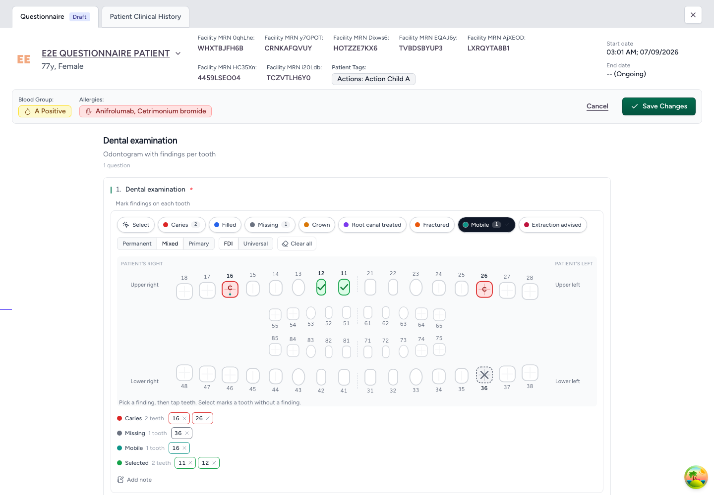

# care_dental_fe

See [SCHEMA.md](SCHEMA.md) for saved fields, validation rules, and submission examples.

A **dental chart (odontogram)** registered question group for the [CARE](https://github.com/ohcnetwork/care_fe)
questionnaire, shipped as a frontend-only CARE plugin. Questionnaire authors add a
"Dental chart" group in the studio; clinicians mark teeth on an interactive chart while
filling the form; the answer is stored on the questionnaire response itself, so the plugin
needs **no plugin-specific backend**.



## What it does

- **One registered group**, `care_dental_fe.tooth_chart`, listed as _Dental chart_
  under _Group_ in the studio's type picker (encounter and patient questionnaires).
- **The chart**: all 32 permanent teeth in FDI/ISO 3950 layout, patient's right on the
  viewer's left, with an optional inner row for the 20 primary teeth (_Permanent · Mixed ·
  Primary_). Numbers switch between FDI and Universal (ADA); the choice is remembered per
  browser.
- **Findings as brushes**: _Select_ marks a tooth without a finding; _Caries, Filled,
  Missing, Crown, Root canal treated, Fractured, Mobile, Extraction advised_ mark it with
  one. Tap a tooth to toggle; drag across teeth to paint several; click a quadrant name to
  mark the whole quadrant. A tooth can carry several findings.
- **Reads back as text**: a summary lists every finding with its teeth, each removable on
  its own. The same component renders the stored answer read-only in
  the encounter's _Responses_ tab, the single-response page and print.
- **Keyboard and screen readers**: one tab stop per chart, arrows move between teeth
  (up/down cross the arch), Space/Enter toggle, each tooth is named ("Upper right first
  molar, 16, Caries").

The group registers a submission validator for saved tooth/finding options, single-value answers, and duplicate tooth/finding pairs. Different findings on the same tooth remain valid. CARE handles required fields and required rows.

## The recorded answer

The group repeats, and each row contains two ordinary choice questions:

- `tooth` — one required FDI tooth code.
- `type` — one optional finding. An empty finding records a plain tooth selection.

The same tooth can appear in several rows, one for each finding. The chart combines
those rows visually. The builder can require at least one row.

Core stores rows in the questionnaire response's existing `sub_results` field, with
the ordinary child answers in each row. Caries and mobility on tooth 16, for example:

```json
{
  "question_id": "<dental group id>",
  "values": [],
  "sub_results": [
    [
      { "question_id": "<tooth id>", "values": [{ "value": "16" }] },
      { "question_id": "<type id>", "values": [{ "value": "caries" }] }
    ],
    [
      { "question_id": "<tooth id>", "values": [{ "value": "16" }] },
      { "question_id": "<type id>", "values": [{ "value": "mobile" }] }
    ]
  ]
}
```

The host owns row creation, updates, removal, validation, drafts and submission.
FDI is the stored tooth identifier; Universal numbering remains a display preference.

## How it plugs into CARE

The manifest contributes `registeredQuestionGroups`, containing an ordinary question
schema, a builder renderer, and a form renderer. The renderer receives nullable child
bindings, row callbacks and an add-row callback. The host uses the same form
renderer, disabled, for recorded responses and print.

The host types used by the plugin are mirrored in [`src/types/host.ts`](src/types/host.ts).
Keep them in sync with the host's group registry contract.

Layout of the source:

- `src/manifest.tsx` — the manifest: one registered group with lazy renderers.
- `src/lib/group.ts` — ordinary child schema and the chart-to-answer mapping.
- `src/lib/teeth.ts` — the dentition as data (FDI ↔ Universal, quadrants, chart rows).
- `src/lib/markers.ts` — the legend (ids, glyphs, colors).
- `src/lib/chart.ts` — the answer model and every operation on it (pure, tested).
- `src/components/tooth-chart/` — the chart UI: `ToothChartInput` (the group renderer),
  `ToothChart` (rows, painting, keyboard), `ToothButton`/`ToothGlyph`, `BrushBar`,
  `ChartSummary`.
- `public/locale/en.json` — the plugin's i18n namespace (`care_dental_fe`); English strings
  are also the in-code defaults, other languages load from `<plugin origin>/locale/<lng>.json`.
- `src/style/index.css` — the stylesheet the remote injects into the host: Tailwind
  utilities compiled against the host's theme tokens (`theme(reference)`), no preflight and no
  `:root` theme of its own. At build time every selector is nested under the root class
  `.care-dental-fe` (`scopeToPluginRoot` in `vite.config.ts`): the host is a Tailwind app
  with the same class names, and an unscoped second utility sheet overrides the host's
  responsive variants (`hidden md:flex`) across the whole page. `src/index.tsx` is the
  production entry; `index.html` → `src/standalone.tsx` (with `harness.css`) is the dev
  harness and is not part of the build.

## Development

```bash
npm install
npm test          # data-model tests (node --test)
npm run typecheck
npm run lint
npm run dev       # standalone harness: the chart with local state, no CARE needed
```

### In-tree with the host (recommended)

Place this repository at `care_fe/apps/care_dental_fe` as a real directory (not a symlink)
and run the host's `npm run dev`. The host auto-discovers `apps/*/src/manifest.tsx`, serves
the plugin through its own Vite graph with HMR, and loads the locale from
`/local-plugins/care_dental_fe/locale/<lng>.json`.

### Standalone remote (production)

```bash
npm run build     # dist/assets/remoteEntry.js + dist/locale/
npm run preview   # serves dist/ on :4177
```

Enable it on the host with `REACT_ENABLED_APPS` (build-time) or a backend `plug_config`
row (runtime), e.g. for local testing:

```
REACT_ENABLED_APPS=ohcnetwork/care_dental_fe@localhost:4177/assets/remoteEntry.js
```

Everything the host owns as a singleton that this plugin imports is declared in
`federation.shared` (`react`, `react-dom`, `react-i18next`) — see the host's
`vite.config.mts` before adding a dependency that the host also ships.

The standalone build stays on **Vite 6**: `@originjs/vite-plugin-federation` rewrites a CSS
placeholder in `remoteEntry.js` during the build, and under Vite 8's bundler that rewrite
does not happen, leaving a remote the host cannot load (`e.forEach is not a function` while
enabling the app). The host's own Vite version does not matter for in-tree development.

## License

MIT
